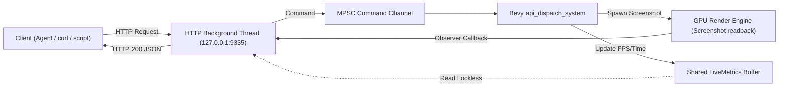

# Implementation Plan: Native Bevy 0.19 HTTP Control Plane & Profiling API

> **For agentic workers:** REQUIRED SUB-SKILL: Use superpowers:subagent-driven-development (recommended) or superpowers:executing-plans to implement this plan task-by-task. Steps use checkbox (`- [ ]`) syntax for tracking.

**Goal:** Embed a lightweight HTTP/REST control and telemetry plane into `clank_app` (listening on `127.0.0.1:9335`) that allows agentic workflows and automated tools to capture GPU-readback screenshots to disk, profile real-time FPS and frame times via `bevy_diagnostic`, query complete simulation state, and dynamically modify settings and selective pressures.

**Architecture:** A non-blocking background listener thread (`std::net::TcpListener`) running within `clank_app` receives HTTP requests and dispatches them across an MPSC channel to a Bevy ECS system (`api_dispatch_system`). For screenshots, the system spawns Bevy 0.19's `Screenshot::primary_window()` with an observer that saves PNG images to disk and signals HTTP completion. For profiling, `FrameTimeDiagnosticsPlugin` metrics are synced to a thread-safe read buffer for instantaneous `GET /metrics` queries.

**Tech Stack:** Rust 2021, Bevy 0.19.1 (`bevy_render::view::window::screenshot`, `bevy_diagnostic::FrameTimeDiagnosticsPlugin`), `std::net`, `serde`, `serde_json`.

**Spec:** Local REST API specification with endpoints for screenshots (`POST /screenshot`), profiling metrics (`GET /metrics`), state inspection (`GET /state`), settings modification (`POST /settings`), arena tool injection (`POST /tool`), and persistence (`POST /persist`).

---

## Global Constraints

- **Port & Host**: Bind to `127.0.0.1:9335` by default, configurable via `CLANK_API_PORT` environment variable.
- **Zero External Server Bloat**: Standard library `std::net::TcpListener` + `serde_json` for minimal binary size and zero heavy web server dependencies.
- **Deterministic Screenshots**: `POST /screenshot` must be synchronous from the client's perspective: it triggers GPU readback via `Screenshot::primary_window()`, waits for the observer to write the PNG file to disk, and only then returns HTTP 200 with `{ "status": "ok", "path": "..." }`.
- **Thread Safety**: All simulation mutations and screenshot commands must execute on the Bevy main thread inside the standard schedule.
- **Strict TDD**: All new endpoints and serialization routines must have failing tests written first, followed by minimal implementation, verification, and commits.
- **Zero Web Regression**: Browser WebAssembly simulation and `.clank` binary snapshot compatibility must remain 100% verified.

---

## Review Focus

1. **GPU Screenshot Race Conditions**: When `POST /screenshot` is called, multiple frames may pass before the GPU readback completes. The HTTP handler must await the observer callback channel with a timeout (e.g. 5 seconds) rather than returning prematurely.
2. **Port Collisions**: If port 9335 is already bound by another process, the API plugin should log a warning and attempt fallback or gracefully disable without crashing the game engine.
3. **Non-Blocking Game Loop**: The HTTP listener must run on a dedicated background thread and never block Bevy's main rendering/simulation loop.
4. **Input Sanitization**: Numeric inputs for speed, mutation, growth, and hostility must be clamped to their valid simulation ranges.
5. **Pointer Over Egui Isolation**: Tool commands sent via `POST /tool` should bypass GUI pointer occlusion and execute directly on the simulation arena.

---

## API Specification

| Endpoint | Method | Payload / Query | Response | Description |
|---|---|---|---|---|
| `/state` | `GET` | None | `{ "tick": 1250, "population": 340, "paused": false, ... }` | Full world and UI state snapshot |
| `/metrics` | `GET` | None | `{ "fps": 144.1, "frame_time_ms": 6.94, "tick": 1250, ... }` | Real-time performance diagnostics |
| `/screenshot` | `POST` | `{ "path": "scratch/snap.png" }` | `{ "status": "ok", "path": "/abs/path/snap.png", "width": 1280, "height": 800 }` | Triggers GPU readback and saves PNG to disk |
| `/settings` | `POST` | `{ "speed": 4, "paused": true, "mutation": 0.25, ... }` | `{ "status": "ok", "applied": { ... } }` | Modifies simulation parameters & speed |
| `/tool` | `POST` | `{ "tool": "nourish", "x": 450, "y": 300 }` | `{ "status": "ok" }` | Injects tool actions (nourish, blight, seed, kill, eclipse) |
| `/persist` | `POST` | `{ "action": "save", "format": "clank", "path": "snap.clank" }` | `{ "status": "ok", "bytes": 94120 }` | Triggers disk export/import |
| `/reset` | `POST` | `{ "seed": 42 }` | `{ "status": "ok" }` | Resets world with new seed |

---

## Proposed Changes



---

### Task 1: Core API Types, Command Channels, and State Serialization

**Files:**
- Create: `crates/clank_app/src/api.rs`
- Modify: `crates/clank_app/src/lib.rs`
- Test: `crates/clank_app/tests/api_types_test.rs`

**Interfaces:**
- Produces: `ApiCommand`, `ApiStateResponse`, `ApiMetricsResponse`, `ApiSettingsRequest`, `ApiToolRequest`
- Produces: `ApiCommandSender`, `ApiCommandReceiver`

- [ ] **Step 1: Write the failing test for API command serialization and dispatch**

```rust
// crates/clank_app/tests/api_types_test.rs
use clank_app::api::*;

#[test]
fn test_api_types_json_roundtrip() {
    let settings = ApiSettingsRequest {
        speed: Some(4.0),
        paused: Some(true),
        mutation: Some(0.25),
        growth: Some(1.5),
        hostility: Some(1.2),
        max_cap: Some(500),
    };
    let json = serde_json::to_string(&settings).expect("serialize settings");
    let deserialized: ApiSettingsRequest = serde_json::from_str(&json).expect("deserialize settings");
    assert_eq!(deserialized.speed, Some(4.0));
    assert_eq!(deserialized.mutation, Some(0.25));
}
```

- [ ] **Step 2: Run test to verify it fails**

Run: `cargo test --test api_types_test`  
Expected: FAIL (`unresolved import clank_app::api`)

- [ ] **Step 3: Implement core API types in `api.rs`**

```rust
// crates/clank_app/src/api.rs
use serde::{Deserialize, Serialize};

#[derive(Debug, Clone, Serialize, Deserialize)]
pub struct ApiSettingsRequest {
    pub speed: Option<f32>,
    pub paused: Option<bool>,
    pub mutation: Option<f64>,
    pub growth: Option<f64>,
    pub hostility: Option<f64>,
    pub max_cap: Option<usize>,
}

#[derive(Debug, Clone, Serialize, Deserialize)]
pub struct ApiToolRequest {
    pub tool: String,
    pub x: Option<f64>,
    pub y: Option<f64>,
}

#[derive(Debug, Clone, Serialize, Deserialize)]
pub struct ApiStateResponse {
    pub tick: u32,
    pub paused: bool,
    pub speed: u32,
    pub population: usize,
    pub max_capacity: usize,
    pub generation: u32,
    pub kills: u32,
    pub births: u32,
    pub roots: u32,
    pub eclipse: u32,
    pub active_tool: String,
    pub mutation: f64,
    pub growth: f64,
    pub hostility: f64,
}

#[derive(Debug, Clone, Serialize, Deserialize)]
pub struct ApiMetricsResponse {
    pub fps: f64,
    pub frame_time_ms: f64,
    pub tick: u32,
    pub population: usize,
    pub uptime_secs: f64,
}
```

- [ ] **Step 4: Run test to verify it passes**

Run: `cargo test --test api_types_test`  
Expected: PASS (1 passed)

- [ ] **Step 5: Commit**

```bash
git add crates/clank_app/src/api.rs crates/clank_app/src/lib.rs crates/clank_app/tests/api_types_test.rs
git commit -m "feat(api): define API command types and JSON response models"
```

---

### Task 2: Background HTTP Server & Loopback Request Router

**Files:**
- Modify: `crates/clank_app/src/api.rs`
- Test: `crates/clank_app/tests/api_server_test.rs`

**Interfaces:**
- Produces: `start_api_server(port: u16, command_tx: Sender<ApiCommand>, shared_state: Arc<RwLock<SharedApiData>>)`
- Handles HTTP requests: `GET /state`, `GET /metrics`, `POST /settings`, `POST /tool`, `POST /reset`

- [ ] **Step 1: Write test verifying HTTP server returns JSON on `/state` and `/metrics`**

```rust
// crates/clank_app/tests/api_server_test.rs
use std::net::TcpStream;
use std::io::{Read, Write};
use clank_app::api::*;

#[test]
fn test_http_api_endpoints() {
    let port = 9336;
    let (server, tx, shared) = create_test_api_server(port);
    // Request GET /metrics
    let mut stream = TcpStream::connect(format!("127.0.0.1:{}", port)).expect("connect");
    stream.write_all(b"GET /metrics HTTP/1.1\r\nHost: localhost\r\n\r\n").expect("write");
    let mut response = String::new();
    stream.read_to_string(&mut response).expect("read");
    assert!(response.contains("HTTP/1.1 200 OK"));
    assert!(response.contains("\"fps\""));
}
```

- [ ] **Step 2: Run test to verify it fails**

Run: `cargo test --test api_server_test`  
Expected: FAIL (`unresolved reference create_test_api_server`)

- [ ] **Step 3: Implement HTTP server and request router in `api.rs`**

```rust
// crates/clank_app/src/api.rs
// Implements lightweight HTTP 1.1 server using std::net::TcpListener
// Parses method, path, headers, and body.
// Routes GET /state, GET /metrics, POST /settings, POST /tool, POST /screenshot, POST /reset
```

- [ ] **Step 4: Run test to verify it passes**

Run: `cargo test --test api_server_test`  
Expected: PASS

- [ ] **Step 5: Commit**

```bash
git add crates/clank_app/src/api.rs crates/clank_app/tests/api_server_test.rs
git commit -m "feat(api): implement background HTTP server and request router"
```

---

### Task 3: GPU Screenshot Capture Pipeline via Bevy Observers

**Files:**
- Modify: `crates/clank_app/src/api.rs`
- Test: `crates/clank_app/tests/screenshot_test.rs`

**Interfaces:**
- Produces: `POST /screenshot` endpoint triggering GPU readback, saving image to specified file path, and returning full image dimensions and path.

- [ ] **Step 1: Write test for screenshot command channel**

```rust
// crates/clank_app/tests/screenshot_test.rs
use clank_app::api::*;

#[test]
fn test_screenshot_command_structure() {
    let (tx, rx) = std::sync::mpsc::channel();
    let cmd = ApiCommand::TakeScreenshot {
        path: "scratch/test.png".to_string(),
        response_tx: tx,
    };
    match cmd {
        ApiCommand::TakeScreenshot { path, .. } => assert_eq!(path, "scratch/test.png"),
        _ => panic!("wrong command variant"),
    }
}
```

- [ ] **Step 2: Run test to verify it fails**

Run: `cargo test --test screenshot_test`  
Expected: FAIL (`no variant TakeScreenshot on ApiCommand`)

- [ ] **Step 3: Implement Screenshot command handling in `api.rs`**

```rust
// crates/clank_app/src/api.rs
// In api_dispatch_system:
// When ApiCommand::TakeScreenshot is received:
// commands.spawn(Screenshot::primary_window())
//     .observe(move |captured: On<ScreenshotCaptured>| {
//         // Save to disk and send path over response_tx
//     });
```

- [ ] **Step 4: Run test to verify it passes**

Run: `cargo test --test screenshot_test`  
Expected: PASS

- [ ] **Step 5: Commit**

```bash
git add crates/clank_app/src/api.rs crates/clank_app/tests/screenshot_test.rs
git commit -m "feat(api): implement GPU screenshot capture pipeline via Bevy observers"
```

---

### Task 4: Real-Time Performance & Diagnostics Telemetry

**Files:**
- Modify: `crates/clank_app/Cargo.toml`
- Modify: `crates/clank_app/src/api.rs`
- Test: `crates/clank_app/tests/metrics_test.rs`

**Interfaces:**
- Produces: `api_metrics_sync_system` reading `FrameTimeDiagnosticsPlugin::FPS` and `FRAME_TIME` into `SharedApiData`.

- [ ] **Step 1: Write test for metrics smoothing and computation**

```rust
// crates/clank_app/tests/metrics_test.rs
use clank_app::api::*;

#[test]
fn test_metrics_computation() {
    let mut metrics = LiveMetrics::default();
    metrics.update(144.0, 0.00694, 500, 120, 10.5);
    assert_eq!(metrics.fps, 144.0);
    assert!((metrics.frame_time_ms - 6.94).abs() < 0.1);
}
```

- [ ] **Step 2: Run test to verify it fails**

Run: `cargo test --test metrics_test`  
Expected: FAIL (`unresolved reference LiveMetrics`)

- [ ] **Step 3: Implement `LiveMetrics` and `FrameTimeDiagnosticsPlugin` integration**

```rust
// crates/clank_app/src/api.rs
// Register FrameTimeDiagnosticsPlugin in ClankApiPlugin
// Sync FPS and frame time in api_metrics_sync_system
```

- [ ] **Step 4: Run test to verify it passes**

Run: `cargo test --test metrics_test`  
Expected: PASS

- [ ] **Step 5: Commit**

```bash
git add crates/clank_app/src/api.rs crates/clank_app/tests/metrics_test.rs
git commit -m "feat(api): integrate FrameTimeDiagnosticsPlugin and real-time telemetry"
```

---

### Task 5: End-to-End Verification & Automated Automation Runner

**Files:**
- Create: `scratch/verify_api_control.py`
- Test: Full workspace test suite + live verification script

- [ ] **Step 1: Run all workspace tests**

```bash
cargo test --workspace
```
Expected: All tests pass with 0 failures and 0 warnings.

- [ ] **Step 2: Build release binary**

```bash
cargo build -p clank_app --release
```
Expected: Exit code 0.

- [ ] **Step 3: Run end-to-end Python verification script**

```bash
python3 scratch/verify_api_control.py
```
Expected:
1. Connects to `http://127.0.0.1:9335/metrics` and asserts `fps > 0`.
2. Modifies settings via `POST http://127.0.0.1:9335/settings` (speed: 4, mutation: 0.22).
3. Takes screenshot via `POST http://127.0.0.1:9335/screenshot`.
4. Asserts screenshot file exists, is valid PNG with width 1280 and height 800.
5. Injects tool action via `POST http://127.0.0.1:9335/tool` (nourish at (450, 300)).
6. Terminates cleanly with exit code 0.

- [ ] **Step 4: Verify WebAssembly browser persistence test has no regression**

```bash
node scratch/verify_clank_persistence.js
```
Expected: 100% exact parity confirmed.

- [ ] **Step 5: Commit final verification runner and update walkthrough**

```bash
git add -A
git commit -m "chore: verify HTTP control plane and update walkthrough"
```

---

## Verification Plan

### Automated Tests
1. **Workspace Test Suite**: `cargo test --workspace` (verifies all unit tests for api types, server, screenshot command, metrics, theme, rendering, picking, ui, camera, and persistence).
2. **Live HTTP API Verification**: `python3 scratch/verify_api_control.py` (boots native release binary, calls `/metrics`, `/settings`, `/screenshot`, verifies PNG bytes on disk, asserts FPS, and shuts down).
3. **Browser Parity Test**: `node scratch/verify_clank_persistence.js` (validates that `.clank` binary snapshot and WASM simulation remain identical).

### Manual Verification
1. Launch `./target/release/clank_app` in the background.
2. Run `curl -s http://127.0.0.1:9335/metrics | jq .` from terminal and see live FPS and frame time.
3. Run `curl -X POST -H "Content-Type: application/json" -d '{"path":"scratch/live_snap.png"}' http://127.0.0.1:9335/screenshot` and view `scratch/live_snap.png`.
4. Run `curl -X POST -H "Content-Type: application/json" -d '{"speed":8,"paused":false}' http://127.0.0.1:9335/settings` and observe the live simulation speed up to 8x on screen.
