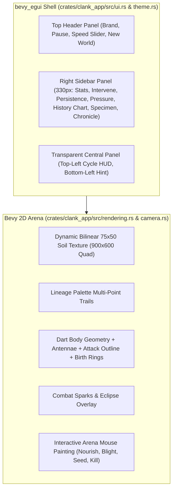

# Implementation Plan: Native Bevy 0.19 Exact Visual Parity with Web Edition

> **For agentic workers:** REQUIRED SUB-SKILL: Use superpowers:subagent-driven-development (recommended) or superpowers:executing-plans to implement this plan task-by-task. Steps use checkbox (`- [ ]`) syntax for tracking.

**Goal:** Transform the native Bevy 0.19 desktop application (`clank_app`) into an exact 1:1 pixel-faithful visual match with `clankolution.html`, including the retro-cyberpunk shell layout, top brand header, styled 330px right-hand sidebar HUD, real-time 3-series history chart, bilinear soil grid background, exact dart/antennae creature morphology, combat particles, and interactive arena tools.

**Architecture:** A unified dual-layer presentation architecture where `bevy_egui` renders the fixed shell layout (53px top header, 330px right sidebar, transparent central overlay with HUD text) using an exact custom color palette and font typography, while Bevy 2D rendering handles the central arena: a bilinear 75×50 dynamic soil texture, multi-segment creature trails, dart-body meshes with neural glow and antennae, expanding birth rings, dashed selection reticles, and interactive mouse tool painting.

**Tech Stack:** Rust 2021, Bevy 0.19.1, `bevy_egui` 0.41.1, `clank_core` 0.1.0, WGPU / Metal / Vulkan / DX12.

**Spec:** Visual design, CSS variables, canvas rendering algorithms, and DOM hierarchy extracted directly from `clankolution.html`.

---

## Global Constraints

- **Exact Color Palette**:
  - Background: `#071012` (`Rgba::rgb(0.027, 0.063, 0.071)`)
  - Top Header: `#0b1719` (`Color32::from_rgb(11, 23, 25)`)
  - Sidebar: `#0c191b` (`Color32::from_rgb(12, 25, 27)`)
  - Stat Cards & Specimen Box: `#101f21` (`Color32::from_rgb(16, 31, 33)`)
  - Borders: `#294041` (panels) and `#2b4243` (cards)
  - Buttons: `#142326` background, `#395054` border, `#2b4849` hover/active
  - Accents: Cyan `#7ce4d5`, Gold `#e6bc78`, Red `#ff755e`, Text Ink `#e7e4dc`, Muted `#8f9c9b`
- **Lineage Colors**: 8 palette colors (`#91e5d2`, `#e6b878`, `#ee786b`, `#be97d7`, `#7fb8df`, `#d4df8b`, `#e4a3bb`, `#89c5a1`) matching `clankolution.html`.
- **Arena Dimensions**: 900×600 logical coordinate space with toroidal wrapping.
- **Strict TDD**: All new functionality must have failing tests written first, followed by minimal implementation, verification, and commits.
- **Zero Web Regression**: Browser WebAssembly simulation and `.clank` binary snapshot compatibility must remain 100% verified.

---

## Review Focus

1. **Window Resizing Behavior**: When the desktop window is resized, the right panel must stay pinned at 330px width and top header at 53px, while the arena camera scales or centers cleanly without clipping.
2. **Egui Context Frame Safety**: All UI rendering systems must run exclusively in `EguiPrimaryContextPass` to prevent font context panics.
3. **Pointer Event Routing**: Mouse clicks and drags over the top header and right sidebar must NOT trigger world tool painting or creature selection.
4. **Soil Grid Visual Interpolation**: The 75×50 cellular soil grid must render with smooth bilinear filtering rather than blocky nearest-neighbor pixels.
5. **Interactive Tool Parity**: Switching between `OBSERVE`, `NOURISH`, `BLIGHT`, `SEED LIFE`, `EXTINGUISH`, and `ECLIPSE` must update both the UI button active states and viewport mouse behaviors.

---

## Proposed Changes



---

### Task 1: Color Palette, Theme, and Custom egui Visuals Engine

**Files:**
- Create: `crates/clank_app/src/theme.rs`
- Modify: `crates/clank_app/src/lib.rs`
- Test: `crates/clank_app/tests/theme_test.rs`

**Interfaces:**
- Produces: `clank_app::theme::setup_clank_theme(ctx: &egui::Context)`
- Produces: Color constants (`COLOR_BG`, `COLOR_TOP_BG`, `COLOR_SIDE_BG`, `COLOR_STAT_BG`, `COLOR_BORDER`, `COLOR_CYAN`, `COLOR_GOLD`, `COLOR_RED`, `COLOR_INK`, `COLOR_MUTED`, `PALETTE`, `PALETTE_40`)

- [ ] **Step 1: Write the failing test for theme colors and styles**

```rust
// crates/clank_app/tests/theme_test.rs
use clank_app::theme::*;

#[test]
fn test_palette_and_colors() {
    assert_eq!(PALETTE.len(), 8);
    assert_eq!(PALETTE_40.len(), 8);
    // Verify Cyan accent
    assert_eq!(COLOR_CYAN.r(), 124);
    assert_eq!(COLOR_CYAN.g(), 228);
    assert_eq!(COLOR_CYAN.b(), 213);
    // Verify Gold accent
    assert_eq!(COLOR_GOLD.r(), 230);
    assert_eq!(COLOR_GOLD.g(), 188);
    assert_eq!(COLOR_GOLD.b(), 120);
}
```

- [ ] **Step 2: Run test to verify it fails**

Run: `cargo test --test theme_test`  
Expected: FAIL (`unresolved import clank_app::theme`)

- [ ] **Step 3: Implement `theme.rs`**

```rust
// crates/clank_app/src/theme.rs
use bevy_egui::egui::{self, Color32, Rounding, Stroke, Visuals};

pub const COLOR_BG: Color32 = Color32::from_rgb(7, 16, 18);
pub const COLOR_TOP_BG: Color32 = Color32::from_rgb(11, 23, 25);
pub const COLOR_SIDE_BG: Color32 = Color32::from_rgb(12, 25, 27);
pub const COLOR_STAT_BG: Color32 = Color32::from_rgb(16, 31, 33);
pub const COLOR_PANEL_LINE: Color32 = Color32::from_rgb(41, 64, 65);
pub const COLOR_STAT_BORDER: Color32 = Color32::from_rgb(43, 66, 67);
pub const COLOR_BTN_BG: Color32 = Color32::from_rgb(20, 35, 38);
pub const COLOR_BTN_BORDER: Color32 = Color32::from_rgb(57, 80, 84);
pub const COLOR_BTN_HOVER: Color32 = Color32::from_rgb(43, 72, 73);

pub const COLOR_INK: Color32 = Color32::from_rgb(231, 228, 220);
pub const COLOR_MUTED: Color32 = Color32::from_rgb(143, 156, 155);
pub const COLOR_CYAN: Color32 = Color32::from_rgb(124, 228, 213);
pub const COLOR_GOLD: Color32 = Color32::from_rgb(230, 188, 120);
pub const COLOR_RED: Color32 = Color32::from_rgb(255, 117, 94);

pub const PALETTE: [Color32; 8] = [
    Color32::from_rgb(145, 229, 210), // #91e5d2
    Color32::from_rgb(230, 184, 120), // #e6b878
    Color32::from_rgb(238, 120, 107), // #ee786b
    Color32::from_rgb(190, 151, 215), // #be97d7
    Color32::from_rgb(127, 184, 223), // #7fb8df
    Color32::from_rgb(212, 223, 139), // #d4df8b
    Color32::from_rgb(228, 163, 187), // #e4a3bb
    Color32::from_rgb(137, 197, 161), // #89c5a1
];

pub const PALETTE_40: [Color32; 8] = [
    Color32::from_rgba_premultiplied(145, 229, 210, 64),
    Color32::from_rgba_premultiplied(230, 184, 120, 64),
    Color32::from_rgba_premultiplied(238, 120, 107, 64),
    Color32::from_rgba_premultiplied(190, 151, 215, 64),
    Color32::from_rgba_premultiplied(127, 184, 223, 64),
    Color32::from_rgba_premultiplied(212, 223, 139, 64),
    Color32::from_rgba_premultiplied(228, 163, 187, 64),
    Color32::from_rgba_premultiplied(137, 197, 161, 64),
];

pub fn setup_clank_theme(ctx: &egui::Context) {
    let mut visuals = Visuals::dark();
    visuals.override_text_color = Some(COLOR_INK);
    visuals.panel_fill = COLOR_SIDE_BG;
    visuals.window_fill = COLOR_SIDE_BG;
    visuals.widgets.noninteractive.bg_fill = COLOR_STAT_BG;
    visuals.widgets.noninteractive.bg_stroke = Stroke::new(1.0, COLOR_PANEL_LINE);
    visuals.widgets.inactive.bg_fill = COLOR_BTN_BG;
    visuals.widgets.inactive.bg_stroke = Stroke::new(1.0, COLOR_BTN_BORDER);
    visuals.widgets.inactive.rounding = Rounding::same(4.0);
    visuals.widgets.hovered.bg_fill = COLOR_BTN_HOVER;
    visuals.widgets.hovered.bg_stroke = Stroke::new(1.0, COLOR_CYAN);
    visuals.widgets.active.bg_fill = COLOR_BTN_HOVER;
    visuals.widgets.active.bg_stroke = Stroke::new(1.0, COLOR_CYAN);
    ctx.set_visuals(visuals);
}
```

- [ ] **Step 4: Run test to verify it passes**

Run: `cargo test --test theme_test`  
Expected: PASS (1 passed)

- [ ] **Step 5: Commit**

```bash
git add crates/clank_app/src/theme.rs crates/clank_app/src/lib.rs crates/clank_app/tests/theme_test.rs
git commit -m "feat(ui): add clankolution theme colors and egui visuals"
```

---

### Task 2: Exact Shell Layout (Top Brand Header, Arena Overlay HUD, and Layout Panels)

**Files:**
- Modify: `crates/clank_app/src/ui.rs`
- Test: `crates/clank_app/tests/ui_test.rs`

**Interfaces:**
- Consumes: `clank_app::theme::*`, `SimWorld`
- Produces: `clank_ui_system` rendering the top header, transparent viewport, and right-hand container.

- [ ] **Step 1: Write test for top header and layout state**

```rust
// Add to crates/clank_app/tests/ui_test.rs
#[test]
fn test_ui_active_tool_selection() {
    let mut state = UiState::default();
    assert_eq!(state.active_tool, ActiveTool::Observe);
    state.active_tool = ActiveTool::Nourish;
    assert_eq!(state.active_tool, ActiveTool::Nourish);
}
```

- [ ] **Step 2: Run test to verify it fails**

Run: `cargo test --test ui_test`  
Expected: FAIL (`no field active_tool on type UiState`)

- [ ] **Step 3: Implement Shell Layout and Header in `ui.rs`**

```rust
// crates/clank_app/src/ui.rs
#[derive(Debug, Clone, Copy, PartialEq, Eq)]
pub enum ActiveTool {
    Observe,
    Nourish,
    Blight,
    SeedLife,
    Extinguish,
    Eclipse,
}

// In clank_ui_system:
// 1. Top Panel (Height 53px, Background #0b1719, Stroke 1px #294041)
egui::Panel::top("header_panel")
    .exact_height(53.0)
    .frame(egui::Frame::NONE.fill(COLOR_TOP_BG).stroke(Stroke::new(1.0, COLOR_PANEL_LINE)))
    .show(ctx, |ui| {
        ui.horizontal_centered(|ui| {
            // Brand: CLANK (white) + O (red) + LUTION (white)
            ui.horizontal(|ui| {
                ui.label(RichText::new("CLANK").size(15.0).strong().color(Color32::from_rgb(243, 233, 215)));
                ui.label(RichText::new("O").size(15.0).strong().color(COLOR_RED));
                ui.label(RichText::new("LUTION").size(15.0).strong().color(Color32::from_rgb(243, 233, 215)));
                ui.add_space(8.0);
                ui.label(RichText::new("AN EXPERIMENT IN INHERITED APPETITE").size(10.0).color(COLOR_MUTED));
            });
            ui.with_layout(egui::Layout::right_to_left(egui::Align::Center), |ui| {
                if ui.button("NEW WORLD").clicked() {
                    sim.reset_with_seed(12345);
                }
                // Speed control
                ui.add(egui::Slider::new(&mut state.sim_speed, 1..=32).text("SPEED"));
                let pause_text = if sim.paused { "RESUME" } else { "PAUSE" };
                if ui.button(pause_text).clicked() {
                    sim.paused = !sim.paused;
                }
            });
        });
    });

// 2. Transparent Central Panel with Arena HUD Labels
egui::CentralPanel::default()
    .frame(egui::Frame::NONE.fill(Color32::TRANSPARENT))
    .show(ctx, |ui| {
        // Top-left cycle HUD
        let cycle_text = format!("CYCLE {:05} / {}", sim.world.tick, if sim.world.eclipse > 0 { "THE HUNGER ECLIPSE" } else { "THE FIRST HUNGER" });
        ui.label(RichText::new(cycle_text).size(10.0).monospace().color(Color32::from_rgb(168, 209, 201)));
        // Bottom-left hint
        ui.with_layout(egui::Layout::bottom_up(egui::Align::Min), |ui| {
            ui.label(RichText::new("Click a creature to inspect its lineage. Choose a tool, then paint on the world.").size(11.0).color(Color32::from_rgb(184, 203, 195)));
        });
    });
```

- [ ] **Step 4: Run test to verify it passes**

Run: `cargo test --test ui_test`  
Expected: PASS

- [ ] **Step 5: Commit**

```bash
git add crates/clank_app/src/ui.rs crates/clank_app/tests/ui_test.rs
git commit -m "feat(ui): implement top header brand and transparent central arena overlay"
```

---

### Task 3: 330px Right-Hand Sidebar with Faithful HUD Cards and 3-Series History Chart

**Files:**
- Modify: `crates/clank_app/src/ui.rs`
- Test: `crates/clank_app/tests/ui_test.rs`

**Interfaces:**
- Produces: 2×2 Stat Grid, Intervene button matrix, Selective Pressure sliders, custom History line chart painter, Specimen card with recurrent activations, Chronicle event log.

- [ ] **Step 1: Write test for history buffer and chronicle event tracking**

```rust
// Add to crates/clank_app/tests/ui_test.rs
#[test]
fn test_history_buffer_push() {
    let mut state = UiState::default();
    state.record_history(100, 1.2, 5);
    assert_eq!(state.history.len(), 1);
    assert_eq!(state.history[0].population, 100);
}
```

- [ ] **Step 2: Run test to verify it fails**

Run: `cargo test --test ui_test`  
Expected: FAIL (`no method named record_history`)

- [ ] **Step 3: Implement History buffer, chart painter, and sidebar sections**

```rust
// crates/clank_app/src/ui.rs
// Right panel:
egui::Panel::right("sidebar_panel")
    .exact_width(330.0)
    .frame(egui::Frame::NONE.fill(COLOR_SIDE_BG).stroke(Stroke::new(1.0, COLOR_PANEL_LINE)))
    .show(ctx, |ui| {
        egui::ScrollArea::vertical().show(ui, |ui| {
            // Eyebrow & Hero
            ui.label(RichText::new("FIELD NOTES / 001").size(10.0).color(COLOR_CYAN));
            ui.heading(RichText::new("Let them become\nsomething else.").size(24.0).color(Color32::from_rgb(238, 229, 213)));
            ui.label(RichText::new("Each creature inherits a tiny quantized recurrent brain and a body. Food blooms. Blood feeds the soil. Nothing is told how to behave.").size(12.0).color(COLOR_MUTED));
            
            // 2x2 Stat Grid
            egui::Grid::new("stat_grid").num_columns(2).spacing([7.0, 7.0]).show(ui, |ui| {
                render_stat_box(ui, "POPULATION", &format!("{}", sim.world.agents.len()), &format!(" / {} capacity", sim.world.max_capacity));
                render_stat_box(ui, "GENERATION", &format!("{}", sim.world.get_max_generation()), " / oldest living");
                ui.end_row();
                render_stat_box(ui, "PREDATIONS", &format!("{}", sim.world.kills), " / total");
                render_stat_box(ui, "LINEAGES", &format!("{}", sim.world.get_root_count()), " / living roots");
                ui.end_row();
            });
            
            // INTERVENE 3x2 Tool Buttons
            render_intervene_tools(ui, state, sim);
            
            // KEEP YOUR WORLD Persistence
            render_persistence_section(ui, state, sim);
            
            // SELECTIVE PRESSURE
            render_pressure_sliders(ui, sim);
            
            // THE RECORD (3-series history chart)
            render_history_chart(ui, state);
            
            // SPECIMEN
            render_specimen_card(ui, sim);
            
            // CHRONICLE
            render_chronicle_log(ui, state);
            
            ui.label(RichText::new("One file. No assets. No API. All decisions happen on your machine.").size(10.0).color(Color32::from_rgb(111, 136, 130)));
        });
    });
```

- [ ] **Step 4: Run test to verify it passes**

Run: `cargo test --test ui_test`  
Expected: PASS

- [ ] **Step 5: Commit**

```bash
git add crates/clank_app/src/ui.rs crates/clank_app/tests/ui_test.rs
git commit -m "feat(ui): implement exact 330px right-hand sidebar HUD with history chart and specimen card"
```

---

### Task 4: High-Fidelity Arena Rendering (Dart Geometry, Bilinear Soil Grid, Antennae, Trails, Sparks)

**Files:**
- Modify: `crates/clank_app/src/rendering.rs`
- Test: `crates/clank_app/tests/rendering_test.rs`

**Interfaces:**
- Produces: `clank_render_system` drawing the bilinear 75×50 soil texture, exact 4-vertex dart polygons with bulk/armor deformation, antennae whiskers, red attack borders, multi-point trails, birth rings, and combat sparks.

- [ ] **Step 1: Write test for dart polygon vertices and antennae logic**

```rust
// Add to crates/clank_app/tests/rendering_test.rs
#[test]
fn test_dart_body_morphology() {
    let agent = clank_core::agent::AgentData::default();
    let vertices = compute_dart_polygon(&agent);
    assert_eq!(vertices.len(), 4);
    // Nose must point forward
    assert!(vertices[0].x > 0.0);
    // Wing tips must have opposite Y values
    assert!((vertices[1].y + vertices[3].y).abs() < 1e-4);
}
```

- [ ] **Step 2: Run test to verify it fails**

Run: `cargo test --test rendering_test`  
Expected: FAIL (`unresolved reference compute_dart_polygon`)

- [ ] **Step 3: Implement Dart geometry, antennae, trails, and bilinear soil texture in `rendering.rs`**

```rust
// crates/clank_app/src/rendering.rs
pub fn compute_dart_polygon(a: &AgentData) -> [Vec2; 4] {
    let r = 2.3 + a.tr[0] * 4.5;
    let nose = Vec2::new(r * 1.5, 0.0);
    let right_wing = Vec2::new(-r * 0.75, r * (0.5 + a.tr[3] * 0.45));
    let rear_notch = Vec2::new(-r * (0.45 + a.tr[5]), 0.0);
    let left_wing = Vec2::new(-r * 0.75, -r * (0.5 + a.tr[3] * 0.45));
    [nose, right_wing, rear_notch, left_wing]
}

// In clank_render_system:
// 1. Bilinear Soil Grid Texture mapped to 900x600 quad at z = -10.0
// 2. Batched Trails rendered via gizmos with lineage colors from PALETTE_40
// 3. Dart polygon outline (red if attack > 0.5, else #153034)
// 4. Antennae whiskers if a.tr[2] > 0.56
// 5. Birth halo ring if a.birth > 0
// 6. Dashed selection ring if selected
// 7. Combat sparks and Eclipse overlay
```

- [ ] **Step 4: Run test to verify it passes**

Run: `cargo test --test rendering_test`  
Expected: PASS

- [ ] **Step 5: Commit**

```bash
git add crates/clank_app/src/rendering.rs crates/clank_app/tests/rendering_test.rs
git commit -m "feat(rendering): implement exact dart morphology, antennae, trails, and bilinear soil grid"
```

---

### Task 5: Interactive World Tools & Viewport Navigation

**Files:**
- Modify: `crates/clank_app/src/camera.rs`
- Modify: `crates/clank_app/src/sim.rs`
- Test: `crates/clank_app/tests/camera_test.rs`

**Interfaces:**
- Consumes: Mouse position, active tool from `UiState`.
- Produces: World coordinate conversion, painting food/toxin on soil, seeding/killing creatures, centering camera on left arena viewport.

- [ ] **Step 1: Write test for world coordinate conversion and tool action**

```rust
// Add to crates/clank_app/tests/camera_test.rs
#[test]
fn test_world_pointer_conversion() {
    let win_pos = Vec2::new(100.0, 150.0);
    let world_pos = screen_to_world(win_pos, Vec2::new(900.0, 600.0), 1.0, Vec2::ZERO);
    assert!(world_pos.x >= 0.0 && world_pos.x <= 900.0);
    assert!(world_pos.y >= 0.0 && world_pos.y <= 600.0);
}
```

- [ ] **Step 2: Run test to verify it fails**

Run: `cargo test --test camera_test`  
Expected: FAIL (`unresolved reference screen_to_world`)

- [ ] **Step 3: Implement interactive world tool painting in `camera.rs` and `sim.rs`**

```rust
// crates/clank_app/src/camera.rs & sim.rs
// On left-mouse drag:
// If active_tool == Nourish: sim.world.soil.add_food(wx, wy, 0.4);
// If active_tool == Blight: sim.world.soil.add_taint(wx, wy, 0.8);
// If active_tool == SeedLife: sim.world.spawn_agent_at(wx, wy);
// If active_tool == Extinguish: sim.world.kill_nearest_agent(wx, wy, 20.0);
// If active_tool == Observe: sim.selected_id = find_agent_near(wx, wy);
```

- [ ] **Step 4: Run test to verify it passes**

Run: `cargo test --test camera_test`  
Expected: PASS

- [ ] **Step 5: Commit**

```bash
git add crates/clank_app/src/camera.rs crates/clank_app/src/sim.rs crates/clank_app/tests/camera_test.rs
git commit -m "feat(sim): add interactive arena painting tools and viewport coordinate mapping"
```

---

### Task 6: Full Verification, Browser Parity, and Live Execution

**Files:**
- Test: Workspace tests
- Script: `scratch/run_release_test.py`
- Test: `scratch/verify_clank_persistence.js`

- [ ] **Step 1: Run all workspace tests**

```bash
cargo test --workspace
```
Expected: All tests pass with 0 failures and 0 warnings.

- [ ] **Step 2: Build release binary**

```bash
cargo build -p clank_app --release
```
Expected: Build succeeds with exit code 0.

- [ ] **Step 3: Live execution test with headless/runner confirmation**

```bash
python3 scratch/run_release_test.py
```
Expected: Confirms Metal GPU initialization, window creation, zero panics, clean exit.

- [ ] **Step 4: Run WebAssembly browser persistence test**

```bash
node scratch/verify_clank_persistence.js
```
Expected: 100% bit-for-bit parity confirmed across browser and `.clank` binary format.

- [ ] **Step 5: Commit final release adjustments and update walkthrough**

```bash
git add -A
git commit -m "chore: verify visual parity and update walkthrough"
```

---

## Verification Plan

### Automated Tests
1. **Workspace Test Suite**: `cargo test --workspace` (verifies all unit tests for theme, rendering, picking, ui, camera, and persistence).
2. **Browser Parity Test**: `node scratch/verify_clank_persistence.js` (validates that `.clank` binary snapshot and WASM simulation remain identical).

### Manual Verification
1. Launch `./target/release/clank_app` side-by-side with `clankolution.html` in Chrome.
2. Confirm the 53px top brand header (`CLANK`**`O`**`LUTION`, speed slider, pause button) matches 1:1.
3. Confirm the 330px right-hand sidebar HUD displays the exact typography, stat boxes, active tool highlights, selective pressure sliders, live 3-series history chart, specimen details, and chronicle event log.
4. Confirm creature bodies render as bioluminescent dart kites with red attack outlines, antennae whiskers, fading multi-point trails, and birth rings over the smooth bilinear soil grid.
5. Confirm clicking and dragging with `NOURISH` paints green food, `BLIGHT` paints red toxin, `SEED LIFE` spawns creatures, and `OBSERVE` selects and inspects creatures.
